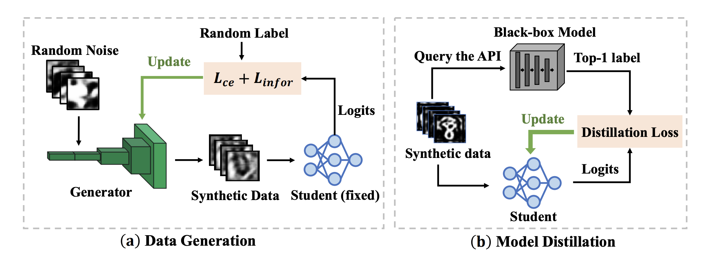
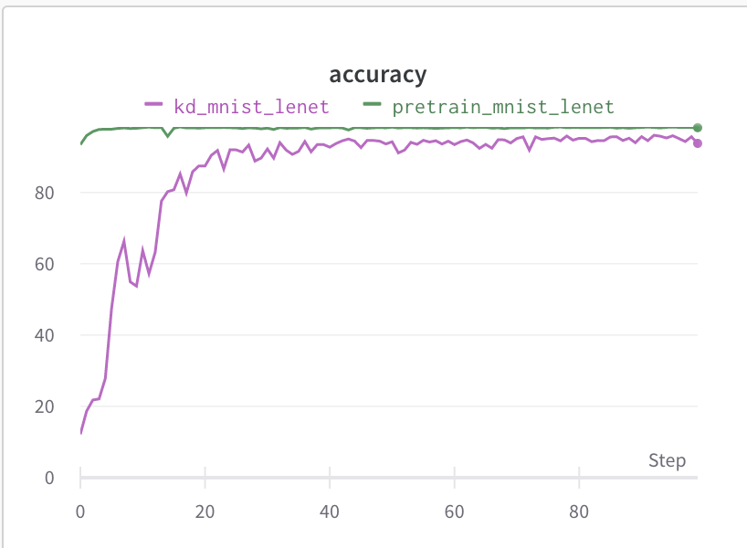

# Black-box model distillation
This repository provides codes for our ICLR23 paper: [IDEAL: Query-Efficient Data-Free Learning from Black-Box Models](https://openreview.net/pdf?id=ConT6H7MWL).

Knowledge Distillation (KD) is a typical method for training a lightweight student model with the help of a well-trained teacher model. 
However, most KD methods require access to either the teacher's training data or model parameter, which is unrealistic. To tackle this problem, recent works study KD under data-free and black-box settings. Nevertheless, these works require a large number of queries to the teacher model, which incurs significant monetary and computational costs. To address these problems, we propose a novel method called query-effIcient Data-free lEarning from blAck-box modeLs (IDEAL), which aims to query-efficiently learn from black-box model APIs to train a good student without any real data.   In detail, IDEAL trains the student model in two stages: data generation and model distillation. Note that IDEAL does not require any query in the data generation stage and queries the teacher only once for each sample in the distillation stage. 


# Install dependencies
Install the following packages through `pip`:
```shell
pip install -r requirements.txt
```
# Datasets
Our experiments are conducted on 7 real-world datasets: MNIST, Fashion-MNIST (FMNIST), CIFAR10, CIFAR100, SVHN, Tiny-ImageNet, and ImageNet subset.
The ImageNet subset is generated from original ImageNet, which consists of 12 classes. We resize the original image with size 224x
224x3 to 64x64x3 for fast training.

# Running the code
The code can be simply run as follows.
## train from scratch, pretrain a teacher model
```
CUDA_VISIBLE_DEVICES=0 python pretrain.py --dataset=cifar10 --net=cnn  --exp_name=pretrain_cifar10_cnn

CUDA_VISIBLE_DEVICES=1 python pretrain.py --dataset=mnist --net=lenet  --epochs=100 --exp_name=pretrain_mnist_lenet
 
```

## data-free distillation

An example of train a student model on mnist:
```shell
CUDA_VISIBLE_DEVICES=2 python ideal.py --epochs=100 --save_dir=run/mnist_1  --dataset=mnist --net=lenet  --exp_name=kd_mnist_lenet --batch_size=250 

```
An example for Distillation.



# Citation
If you plan to use our code in your research, please cite us using:
```
@inproceedings{
zhang2023ideal,
title={{IDEAL}: Query-Efficient Data-Free Learning from Black-Box Models},
author={Jie Zhang and Chen Chen and Lingjuan Lyu},
booktitle={The Eleventh International Conference on Learning Representations },
year={2023},
url={https://openreview.net/forum?id=ConT6H7MWL}
}
```
If you have any questions regarding the code, please feel free to contact Jie Zhang (zj_zhangjie@zju.edu.cn) or Lingjuan Lyu (Lingjuan.Lv@sony.com).

###### Copyright 2023, Sony AI, All rights reserved.


